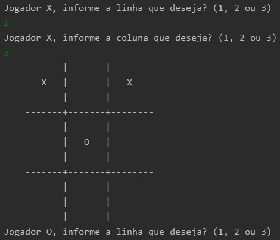
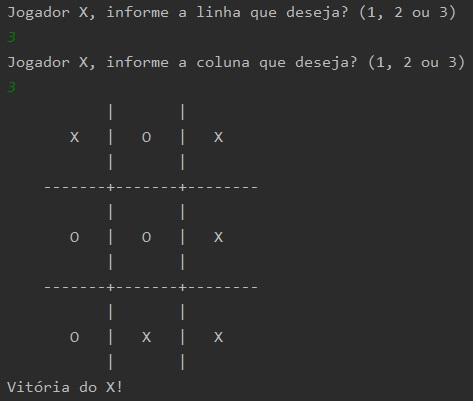
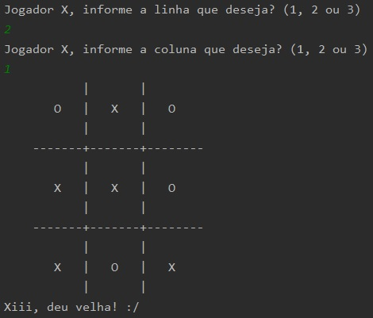

# Jogo da Velha (Java)
Jogo da Velha feito na linguagem Java utilizando [IntelliJ IDEA](https://www.jetbrains.com/idea/), para ser jogado via terminal / prompt de comando.

### Compilar:
`$ javac src/com/niemietz/JogoDaVelha.java` 

### Executar:
`$ java JogoDaVelha` 

### Preview:
 
**[1.1. Imagem do jogo em execução]**

 
**[1.2. Imagem do jogo ao finalizar com vitória]**

 
**[1.3. Imagem do jogo ao finalizar dando velha]**